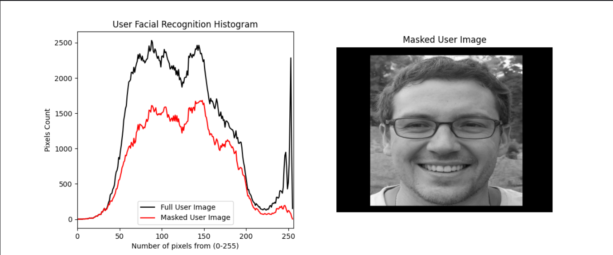

# 📊 Image Histogram Masking — ROI Brightness Analysis with OpenCV

<p align="center">
  
  
  
</p>

> An image processing and data visualization tool built with **Python, OpenCV, and Matplotlib**. This project demonstrates how to manipulate digital image matrices using bitwise masking (`cv2.bitwise_and`) to isolate a specific region of interest (ROI), then extract and plot a 256-channel grayscale brightness distribution via histogram analysis (`cv2.calcHist`).

<p align="center">
  
</p>

---

## 💡 What This Project Demonstrates

Raw pixel data is just a matrix of numbers — this project shows how to work with that matrix directly rather than treating an image as a black box. A binary mask is applied over the source image using bitwise operations to isolate a specific region of interest, and `cv2.calcHist` is then used to compute the grayscale intensity distribution across that region, visualized as a 256-bin histogram with Matplotlib.

---

## ✨ Core Features

| Feature | Description |
|---|---|
| 🎭 **Region of Interest (ROI) masking** | Uses `cv2.bitwise_and` with a binary mask to isolate a specific area of the image for analysis, ignoring everything outside it. |
| 📈 **Grayscale histogram analysis** | Computes a 256-channel brightness distribution with `cv2.calcHist`, showing how pixel intensities are spread across the masked region. |
| 🖼️ **Visual output** | Renders the masked ROI alongside its histogram plot using Matplotlib for direct visual comparison. |

---

## 🔄 How It Works

- **Load the source image** — read in with OpenCV as a NumPy pixel matrix.
- **Build a binary mask** — define the region of interest as a black-and-white mask the same size as the image.
- **Apply the mask** — `cv2.bitwise_and` combines the image and mask so only the ROI's pixels remain active.
- **Compute the histogram** — `cv2.calcHist` counts how many pixels fall into each of the 256 grayscale intensity bins within the masked region.
- **Plot the result** — Matplotlib renders the brightness distribution as a histogram graph alongside the masked image.

---

## 🛠️ Tech Stack

| Domain | Technologies Used |
|---|---|
| **Language** | Python 3.x |
| **Image processing** | OpenCV (`cv2.bitwise_and`, `cv2.calcHist`) |
| **Data visualization** | Matplotlib |
| **Data handling** | NumPy |

---

## 🚀 Getting Started

### Prerequisites
- Python 3.x
- pip

### 1. Clone the repository
```bash
git clone https://github.com/DevTsamenyGabriel/image-histogram-masking.git
cd image-histogram-masking
```

### 2. Install dependencies
```bash
pip install opencv-python matplotlib numpy
```

### 3. Run the script
```bash
python main.py
```

---

## 📁 Project Structure (Typical)

```text
image-histogram-masking/
├── main.py
├── git_Assets/
│   └── histogram_image.png
└── README.md
```

---

## 🔧 Notes

- Swap in your own image by changing the input path in `main.py`.
- The mask shape can be adjusted (rectangle, circle, or custom contour) to target different ROIs.
- Works on both grayscale and color images — color images are converted to grayscale before histogram computation.

---

## 👤 Contact

GitHub: **@DevTsamenyGabriel**
